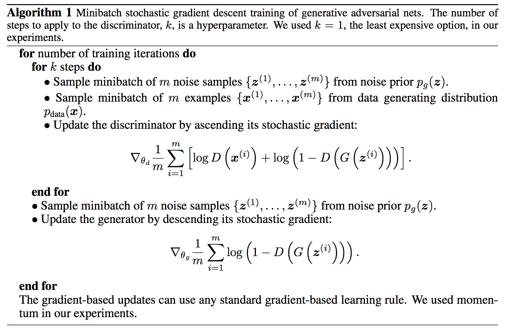

#Generative Adversarial Nets 
April 29, 2017 4:42 AM

이달 초 TensorFlowKR facebook community에서 [PR12](https://youtu.be/auKdde7Anr8?list=PLlMkM4tgfjnJhhd4wn5aj8fVTYJwIpWkS)라는 논문 읽기 모임이 만들어졌습니다. 잘 알려진 엄태웅님의 [Awesome - Most Cited Deep Learning Papers](https://github.com/terryum/awesome-deep-learning-papers)에 소개된 논문 100편을 1년 동안 매주 2편씩 스터디 하고 있습니다. PR12에서 다룬 첫 번째 논문이 지금 소개하려는 Ian J. Goodfellow의 ["Generative Adversarial Nets"](http://arxiv.org/abs/1406.2661v1)입니다.

GAN은 2016년에 가장 많은 관심을 받았던 주제이며, unsupervised learning의 한 가지 방법입니다. Yann LeCun 교수가 ["the most interesting idea in the last 10 years in ML"](https://www.quora.com/What-are-some-recent-and-potentially-upcoming-breakthroughs-in-deep-learning)로 꼽아 유명세를 타기도 했습니다.

GAN의 핵심 아이디어는 두 개의 뉴럴넷(Discriminator와 Generator)을 동시에 트레이닝해서 서로 경쟁시키는 것입니다. Generator $$$G(z)$$$는 진짜 같은 data를 만들어 내려 하고, Discriminator $$$D(x)$$$는 현재 자기가 보고 있는 sample이 실제 data인지 Generator가 만든 가짜인지 판별하려고 합니다. (여기서 $$$G(z)$$$의 $$$z$$$는 Generator의 입력이 되는 확률 변수로 $$$p_z(z)$$$라는 분포를 따르고, $$$D(x)$$$의 $$$x$$$는 실제 데이터(주어진 이미지)를 의미하며 $$$p_{data}(x)$$$라는 분포를 따릅니다.)

Value function을 식으로 정리하면 아래와 같습니다.

$$
\min_G \max_D V(D,G) = \mathbb{E}_{x\sim p_{data}~(x)}[log D(x)] + \mathbb{E}_{z\sim p_x(z)}[log(1-D(G(z)))]
$$

오른쪽 첫 번째 항인 $$$\mathbb{E}_{x\sim p_{data}~(x)}[log D(x)]$$$에서 Discriminator $$$D(x)$$$는 실제 data와 $$$G(z)$$$가 만들어낸 data에 정확한 label을 붙(일 확률을 높)이려는 방향으로 학습됩니다. 한편, 두 번째 항 $$$\mathbb{E}_{z\sim p_x(z)}[log(1-D(G(z)))]$$$에서 Generator $$$G(z)$$$는 $$$log(1-D(G(z)))$$$을 최소화하려는 방향으로 학습됩니다. 이와 같은 특성 때문에 GAN의 value function은 흔히 min max, 또는 minimax라는 문제가 됩니다. 이 용어는 게임 이론에서 유래된 단어입니다. 

이 논문에 예시된 알고리즘은 아래와 같습니다.

> 

요약하면, stochastic gradient descent (SGD) 계열의 알고리즘을 적용해 minibatch 단위로 Discriminator $$$D(x)$$$와 Generator $$$G(z)$$$를 번갈아 가며 training 시킵니다. 일반적으로 $$$D(x)$$$가 $$$G(z)$$$보다 빨리 성장하는 경향이 있습니다. 그런 경우, $$$G(z)$$$가 아직 미숙한데 $$$D(x)$$$가 너무 결과를 잘 판별해 버리면 $$$G(z)$$$가 쉽게 죽어버립니다. 두 모델이 균형 있게 성장하도록 많은 튜닝이 필요합니다. 

구현 시 더 빠른 학습을 위해 learning rate를 adaptation하는 Adam 등의 최적화 기법을 적용하기도 합니다. 참고로 Adam을 포함해 흔히 사용되는 gradient descent optimization algorithm들은 Sebastian Ruder의 [블로그](http://sebastianruder.com/optimizing-gradient-descent/)와 [논문](http://arxiv.org/abs/1609.04747)에 잘 정리되어 있습니다.

위의 알고리즘이 converge하는 것을 이 논문에서는 KL (Kullback-Leibler) divergence와 JS (Jensen-Shannon) divergence를 사용해서 증명을 시도합니다. 그런데 실제 구현을 neural network으로 하면서도 증명은 probability function의 관점에서 하기 때문에 다소 억지로 맞춘 듯한 느낌이 있습니다. Training이 어려운 것과 함께 이러한 GAN의 단점을 극복하기 위해, 더 엄밀한 수학적 전개를 적용한  [Wasserstein GAN (WGAN)](https://arxiv.org/pdf/1701.07875v1.pdf)이라는 논문이 후에 주목받게 됩니다.

현재까지 알려진 GAN의 장단점은 아래와 같습니다.
- 장점
	- 결과물의 quality가 좋다: VAE등 기존 연구 대비 선명
	- 출력이 빨리 나온다: PixelRNN등 픽셀 단위 출력 대비
- 단점
	- training이 unstable하다.
	- 정량적 quality 측정 기준 미비: 사람의 주관적 판단에 의존
	- oscillation: 오래 training해도 더 이상 수렴 못하는 현상
	- mode collapsing 문제: 비슷비슷한 결과물이 나오는 현상

최근 GAN의 인기는 앞서 언급한 Arjovsky의 [WGAN](https://arxiv.org/pdf/1701.07875v1.pdf), Radford의 [DCGAN](https://arxiv.org/abs/1511.06434), Chen의 [InfoGAN](https://arxiv.org/abs/1606.03657) 등 다양한 후속 연구에 힘입은 바가 큽니다. 이에 대해서는 다른 포스팅에서 더 다뤄보도록 하겠습니다.

<iframe width="560" height="315" src="https://www.youtube.com/embed/L3hz57whyNw?list=PLlMkM4tgfjnJhhd4wn5aj8fVTYJwIpWkS" frameborder="0" allowfullscreen></iframe>

**References**
- [엄태웅 님의 "Awesome - Most Cited Deep Learning Papers"](https://github.com/terryum/awesome-deep-learning-papers)
- [Ian Goodfellow의 paper @arXiv.org](http://arxiv.org/abs/1406.2661v1)
- [유재준 님의 블로그 "초짜 대학원생 입장에서 이해하는 Generative Adversarial Nets (1)"](http://jaejunyoo.blogspot.com/2017/01/generative-adversarial-nets-1.html)
- [유재준 님의 블로그 "초짜 대학원생 입장에서 이해하는 Generative Adversarial Nets (2)"](http://jaejunyoo.blogspot.com/2017/01/generative-adversarial-nets-2.html)
- [Ian Goodfellow의 NIPS 2016 Tutorial 슬라이드](https://media.nips.cc/Conferences/2016/Slides/6202-Slides.pdf)
- [Ian Goodfellow의 NIPS 2016 Tutorial 동영상](https://sec.ch9.ms/ch9/6b3d/57930795-7f62-4218-8e18-888623426b3d/Goodfellow_mid.mp4)
- [김남주 님의 slide "Generative Adversarial Networks (GAN)"](https://www.slideshare.net/ssuser77ee21/generative-adversarial-networks-70896091?qid=73145ce5-644c-4d03-8d55-b2da0a8b28e2&v=&b=&from_search=1)

[Tag] Machine Learning, GAN, PR12
[Category] Machine Learning